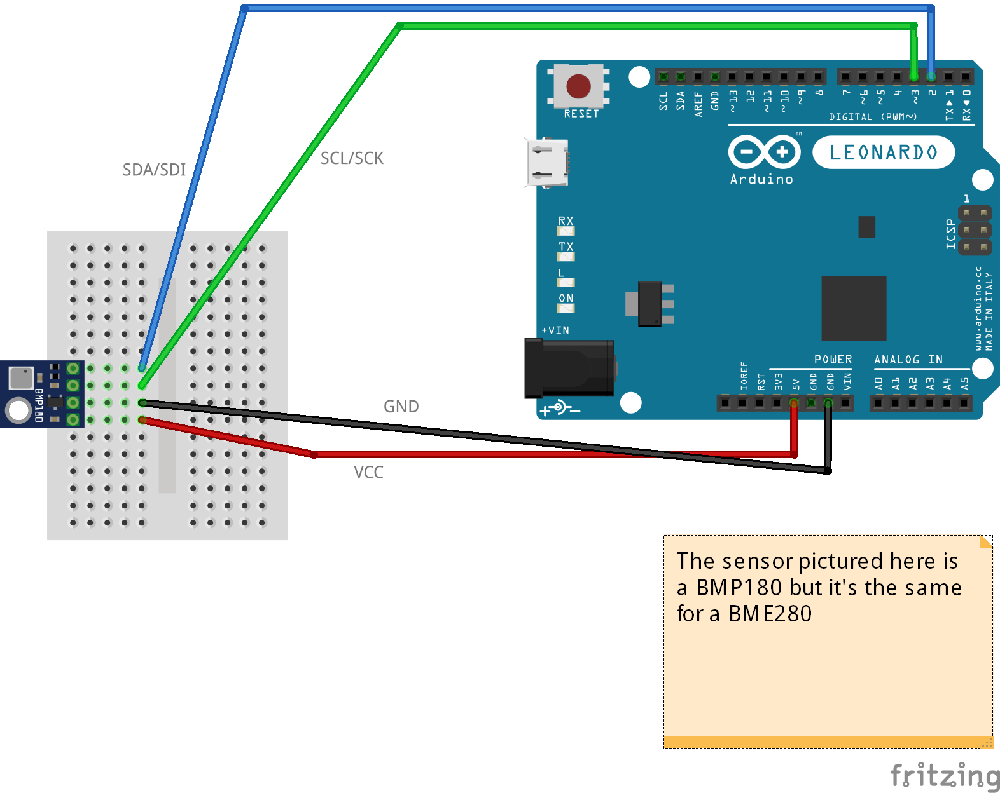

# BME280 I2C Test

BME280 is a sensor for pressure, humidity and temperature. Initially made by [Bosch](https://www.bosch-sensortec.com/bst/products/all_products/bme280).

## Schema

## Code

The code requires 1 library:
* BlueDot_BME280 [https://github.com/BlueDot-Arduino/BlueDot_BME280](https://github.com/BlueDot-Arduino/BlueDot_BME280)

The code contains comments that should allow you to understand everything.