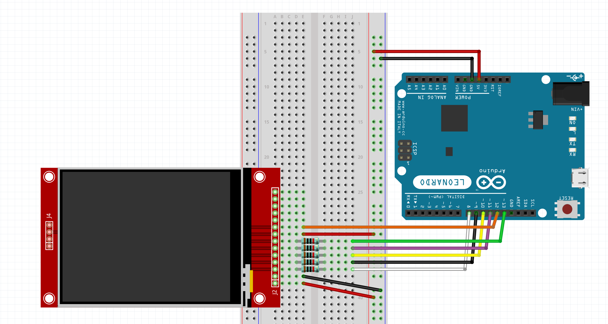

# LCD Screen with ILI9342 controller

Generic LCD screen with controller found all over.

Screen can handle 5v on VCC and backlight. BUT its control pins are built to handle 3.3v only. The Arduinos use 5v for digital signal, so we need to lower them down with 10k resistors (except MISO since it's sending from the screen to the Arduino).

## Schema



## Code

The code requires 2 libraries:
* `Adafruit ILI9341` library, with its dependency `Adafruit GFX Library`

The code is based on the default example from the `Adafruit ILI9341` library. Added pins definition + using the software SPI `Adafruit_ILI9341` constructor for an Arduino Leonardo. I tried to use the hardware SPI but can't make it work for some reason. Which is a shame because it's supposed to be faster.

## Output

Software SPI is slow.

```
ILI9341 Test!
Display Power Mode: 0x94
MADCTL Mode: 0x48
Pixel Format: 0x5
Image Format: 0x80
Self Diagnostic: 0xC0
Benchmark                Time (microseconds)
Screen fill              28889716
Text                     1186036
Lines                    11294532
Horiz/Vert Lines         2330976
Rectangles (outline)     1480460
Rectangles (filled)      58785032
Circles (filled)         6303888
Circles (outline)        4924412
Triangles (outline)      2615264
Triangles (filled)       19410276
Rounded rects (outline)  2810996
Rounded rects (filled)   59553908
Done!
```