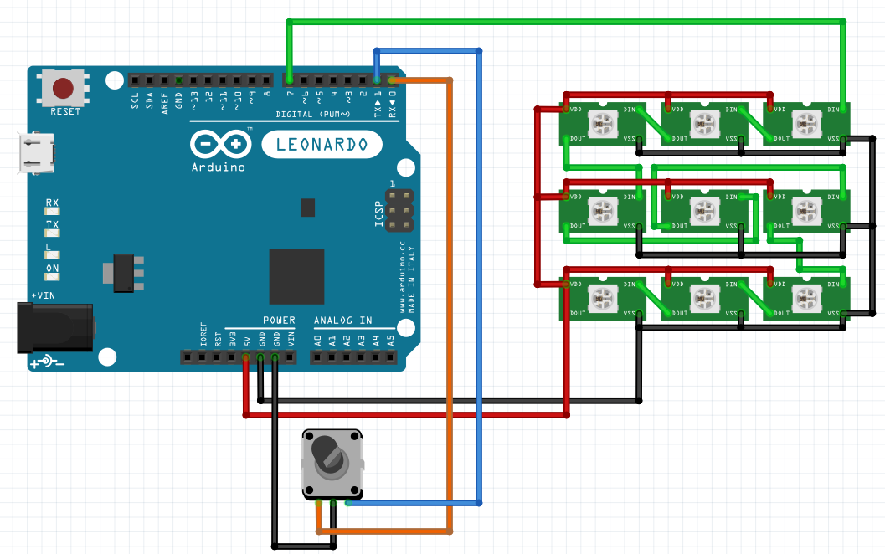

# WS2812B RGB LEDs array with Arduino Leonardo

## Schema

This is a rough diagram of how an array of WS2812B is wired. I bought a pre-assembled array of 8x8 = 64 LEDs, you can find various arrays of the same sort online. The rotary encoder is just a standard 3 pins encoder.

## Code

This code requires 2 libraries (both available in Arduino IDE library manager)

* [FastLED](https://github.com/FastLED/FastLED)
* ["Encoder" by Paul Stoffregen](https://www.pjrc.com/teensy/td_libs_Encoder.html)

In the top of the file, you can change `SCRIPT_MODE` value to 0, 1 or 2 to use the rotary encoder to control different things.
