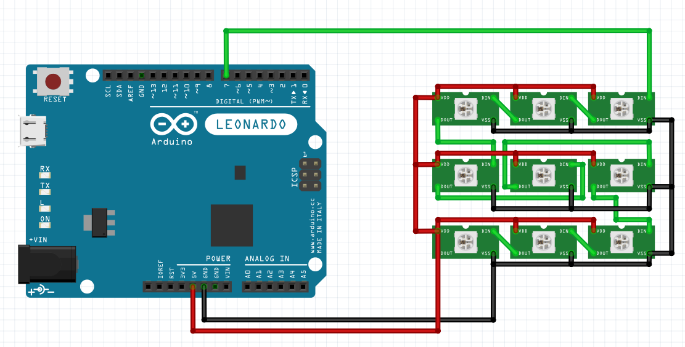

# WS2812B RGB LEDs array with Arduino Leonardo

## Schema

This is a rough diagram of how an array of WS2812B is wired. I bought a pre-assembled array of 8x8 = 64 LEDs, you can find various arrays of the same sort online.

## Code

This code requires 1 library

* [FastLED](https://github.com/FastLED/FastLED)

