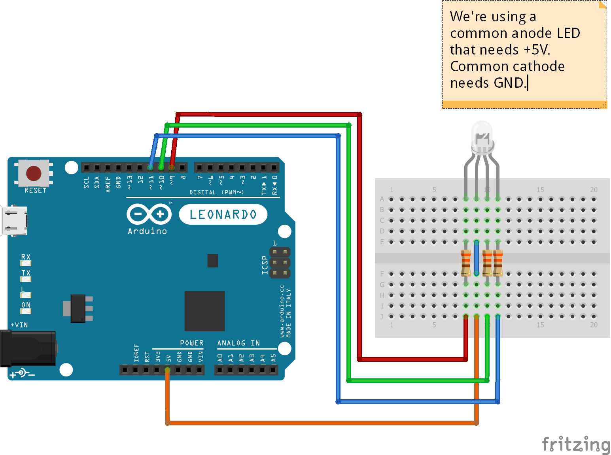

# RGB LED test

It's possible and very easy to power an RGB LED from an Arduino, and control its color. All Arduinos should be capable of doing so, just make sure you use PWM pins.

## Schema

## Code

There's not much to say about it, I believe the code and comments are enough to understand what's going on. We're not using any library whatsoever.