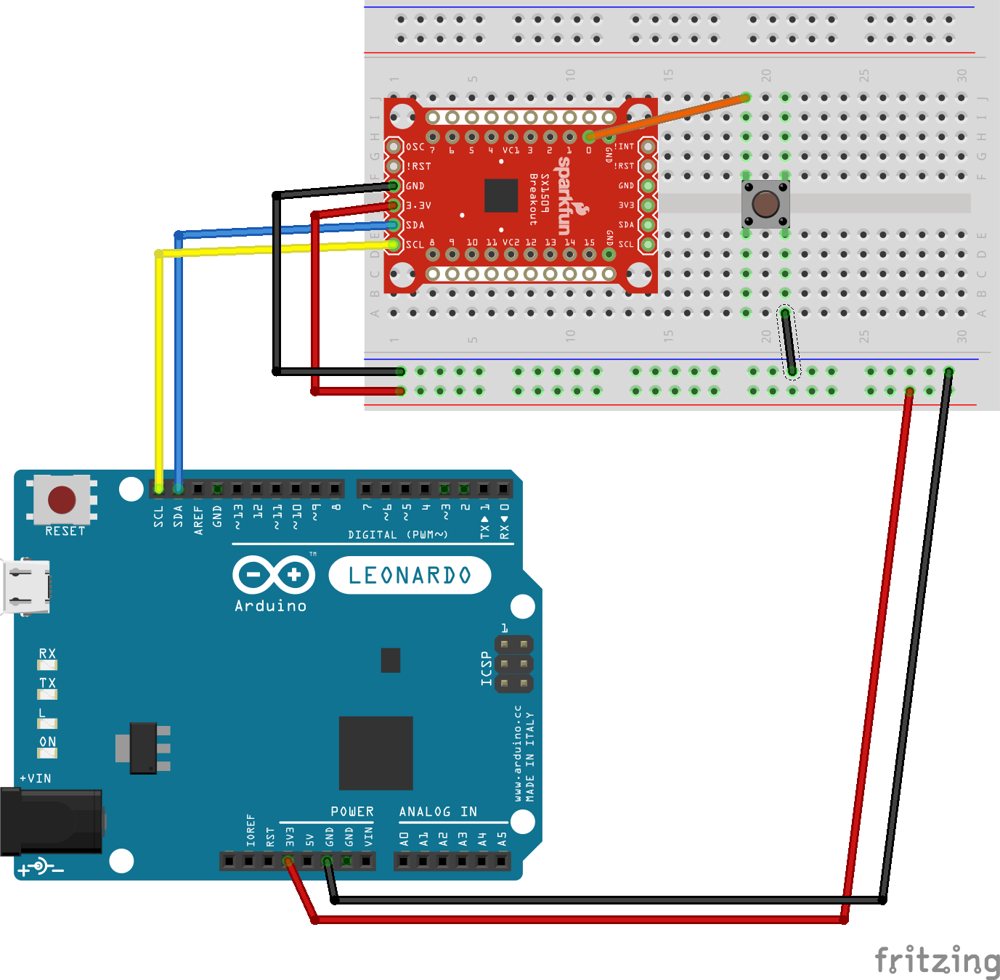

# SX1509 I/O Expander

See [MODULES](../MODULES.md) for other modules and for info about the SX1509

Things to know:
* 3.3V max!
* I2C address is `0x3E` by default (but might change depending on your breakout board!)

## Schema

## Code

The code requires 2 libraries
* Wire (for I2C communication)
* SparkFunSX1509 for using the SX1509 itself

