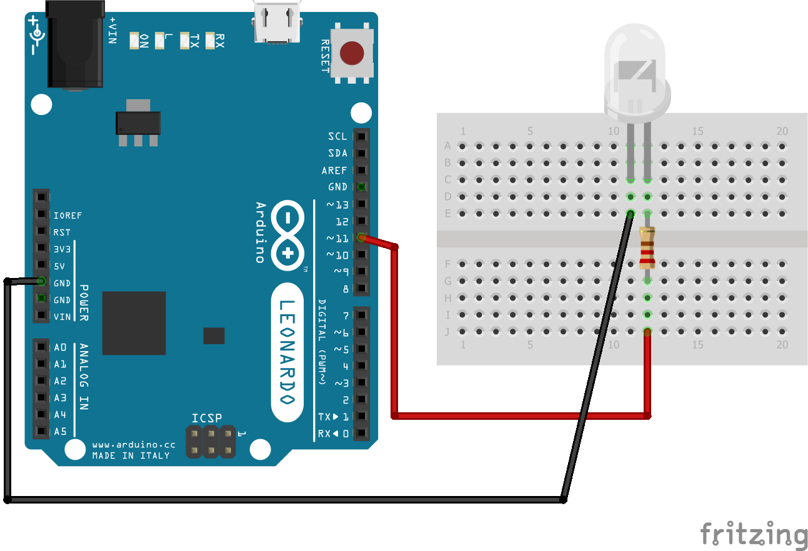

# Blinking LED

We need a resistor to avoid burning the LED. 

## Schema

The resistor is 220Ohm, but you can use a resistor from 100Ohm up to 1000Ohm.

## Code

There's not much to say about it, I believe the code and comments are enough to understand what's going on. We're not using any library whatsoever.