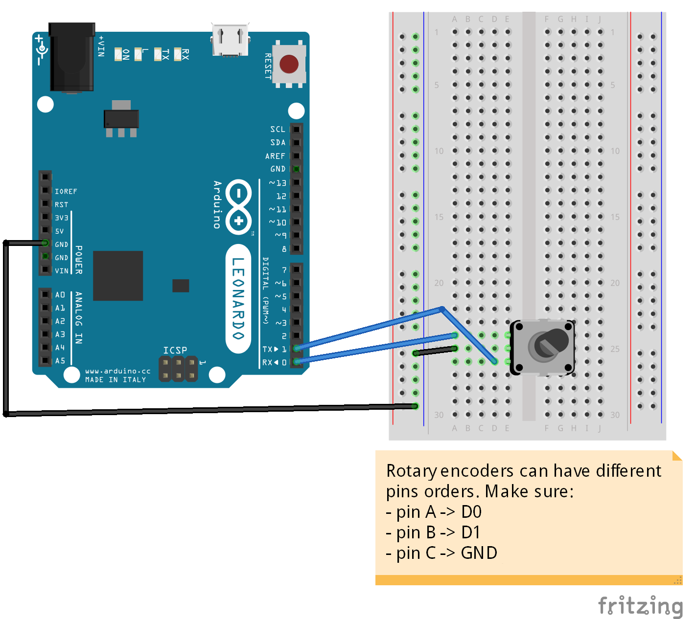

# Rotary Encoder - MIDI commands

If you don't know what a rotary encoder is, the official Arduino playground has [a nice documentation](http://playground.arduino.cc/Main/RotaryEncoders) about them.

## Schema

## Code

The code requires 3 libraries:
* MIDI_Controller [https://github.com/tttapa/MIDI_controller](https://github.com/tttapa/MIDI_controller)
* encoder [https://www.pjrc.com/teensy/td_libs_Encoder.html](https://www.pjrc.com/teensy/td_libs_Encoder.html) (dependency)
* MIDIUSB [https://github.com/arduino-libraries/MIDIUSB](https://github.com/arduino-libraries/MIDIUSB) (dependency)

### MIDI_CONTROLLER

This library makes it really easy to create MIDI controls from buttons, switches, potentiometers, faders, sensors, rotary encoders... The only step required is to create your control, apply some settings to it and the library will take care of detecting and sending commands to the computer. That library also makes the Arduino Leonardo (and other compatible boards) to be detected as a MIDI device on your computer. [See full documentation](https://github.com/tttapa/MIDI_controller/wiki/Library-documentation)