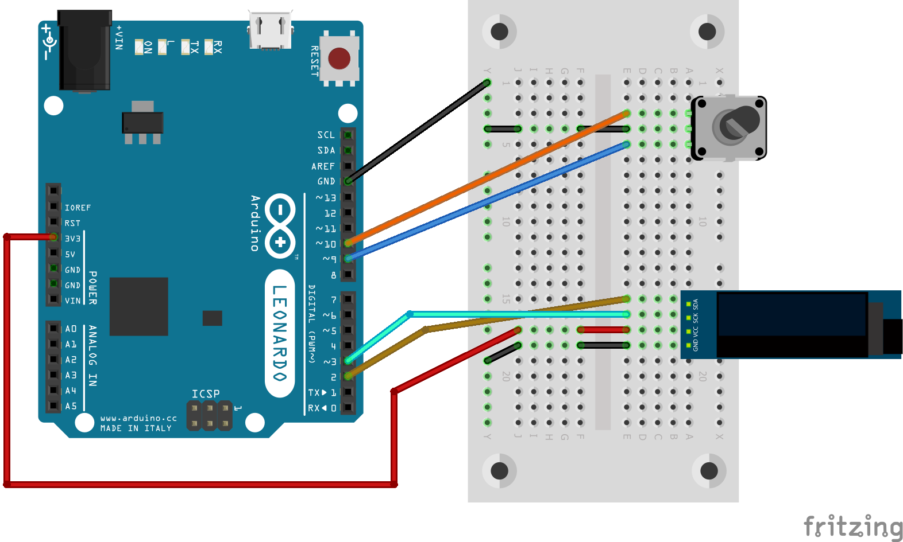

# SSD1306 128x32 OLED screen with rotary encoder

## Schema

Note: The OLED screen is not present by default in Fritzing. Import it from the `OLED 128x32 I2C Monochrome Display.fzpz` file in the `Test-screen-SSD1306-128x32-adafruit` directory.

## Code

This test uses 2 libraries:
* screen [SSD1306Ascii](https://github.com/greiman/SSD1306Ascii)
* encoder [https://www.pjrc.com/teensy/td_libs_Encoder.html](https://www.pjrc.com/teensy/td_libs_Encoder.html)

The code is commented. If you want to know more about the libraries, refer to the dedicated tests.

This code uses *7754 bytes* of program storage space and *319 bytes* of memory.