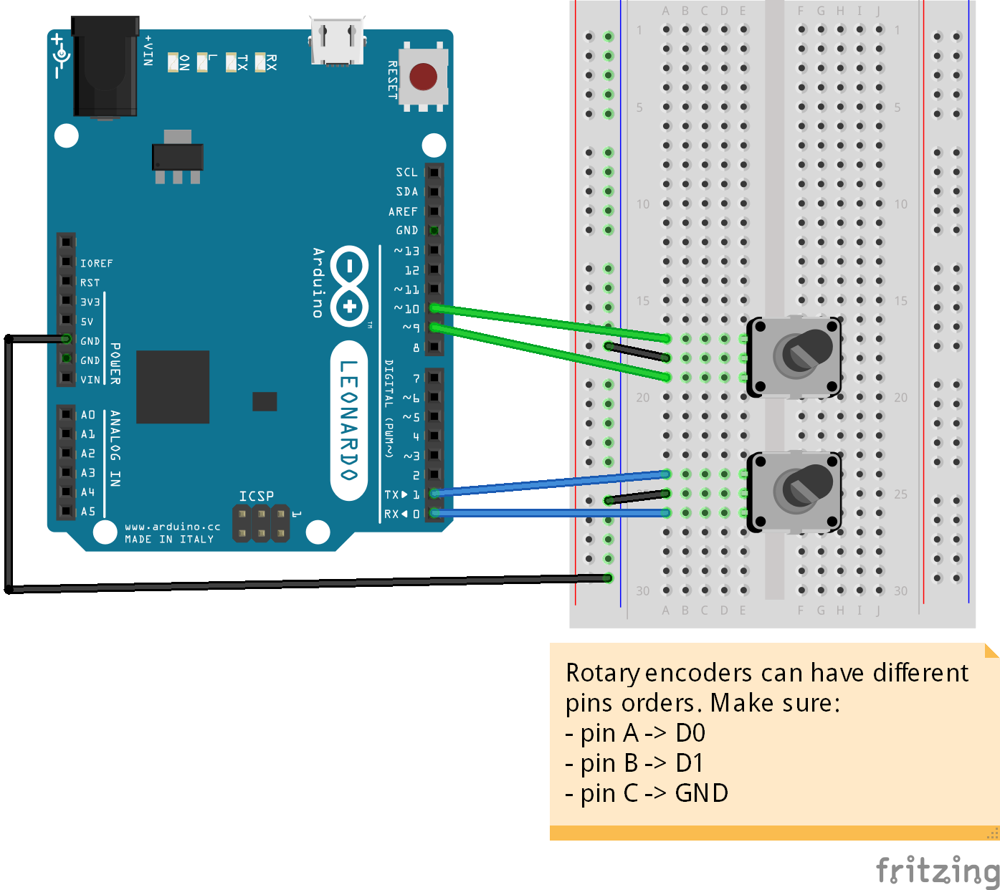

# Rotary Encoder - Testing and sending serial messages

If you don't know what a rotary encoder is, the official Arduino playground has [a nice documentation](http://playground.arduino.cc/Main/RotaryEncoders) about them.

## Schema

## Code

The code requires 1 library:
* encoder [https://www.pjrc.com/teensy/td_libs_Encoder.html](https://www.pjrc.com/teensy/td_libs_Encoder.html)

The code contains comments that should allow you to understand everything. If you're curious about *debouncing*, check [the official Arduino debounce documentation](https://www.arduino.cc/en/Tutorial/Debounce).

### Encoder

The encoder library allows us to easily interact with the encoder, without any hassle.