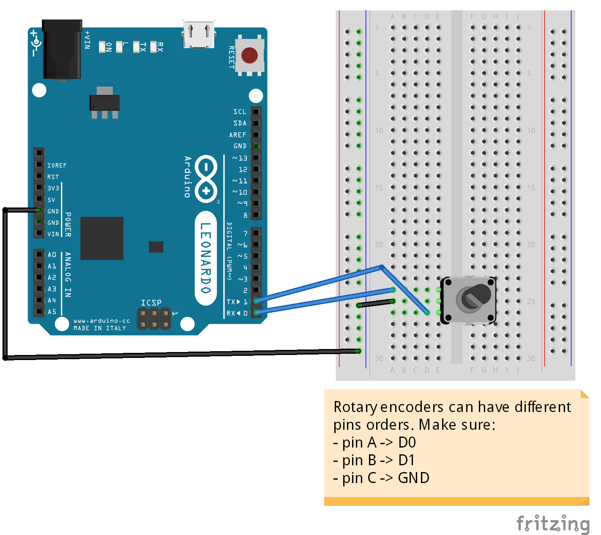

# Rotary Encoder - Control computer volume

If you don't know what a rotary encoder is, the official Arduino playground has [a nice documentation](http://playground.arduino.cc/Main/RotaryEncoders) about them.

## Schema

## Code

The code requires 2 libraries:
* encoder [https://www.pjrc.com/teensy/td_libs_Encoder.html](https://www.pjrc.com/teensy/td_libs_Encoder.html)
* Project-HID [https://github.com/NicoHood/HID](https://github.com/NicoHood/HID)

### Encoder

The encoder library allows us to easily interact with the encoder, without any hassle.

### Project-HID

Project-HID allows us to make the Arduino Leonardo appear as a *consumer* USB product on a computer, which is the only way to control volume on Windows machine (and probably OSX too). See [the documentation](https://github.com/NicoHood/HID/wiki/Consumer-API) for more information about `Consumer`. The library has some pre-defined constants for common USB codes, but you can send pretty much everything you want.

For more information about *consumer* USB codes, check the official USB documentation on HID usage tables [https://www.usb.org/document-library/hid-usage-tables-112](https://www.usb.org/document-library/hid-usage-tables-112). Codes for *consumer* hardware are on page 75).