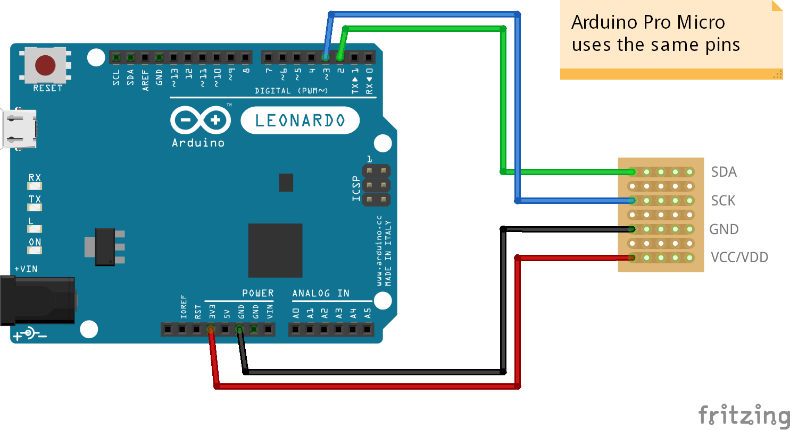

# SSD1306 OLED screen with Arduino Leonardo/Arduino Pro Micro

This example uses a cheap OLED screen with 4 pins in total:
* VCC/VDD
* GND
* SCK (~= SCL)
* SDA

These kind of screens can be found online for cheap, they are pretty common.

Make sure your screen accepts 5V (although they almost all accept 5V).

## Schema

## Code

This test uses 2 libraries from Adafruit:
* [Adafruit_SSD1306](https://github.com/adafruit/Adafruit_SSD1306)
* [Adafruit-GFX-Library](https://github.com/adafruit/Adafruit-GFX-Library) (dependency of the above one)

Those libraries are quite heavy, unfortunately, but they allow you to do a lot of different things.

## Links

* http://www.xtronical.com/basics/displays/oled-128x64-arduino/
* https://learn.adafruit.com/monochrome-oled-breakouts/arduino-library-and-examples
* https://projetsdiy.fr/ssd1306-mini-ecran-oled-i2c-128x64-arduino/ (fr)
* https://www.instructables.com/id/Utiliser-Un-%C3%89cran-OLED-124x68-Sur-Arduino/ (fr)