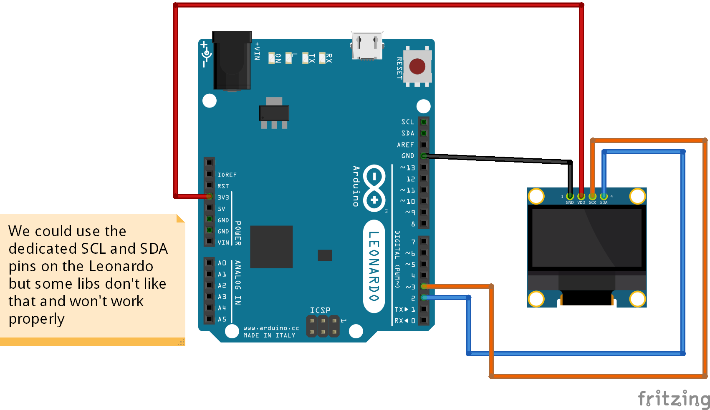

# SSD1306 OLED screen with Arduino Leonardo/Arduino Pro Micro

To learn more on OLED display (how to wire it), check the [README](../Test-screen-SSD1306-128x64-adafruit/README.md) in the `Test-screen-SSD1306-128x64-adafruit` folder

## Schema



## Code

This test uses 1 library:
* [arduino-lib-oled](https://github.com/durydevelop/arduino-lib-oled)

**NOTE:** This library requires you to modify a core Arduino lib file as it requires the `printf()` function that is not there by default. [Read More](http://playground.arduino.cc/Main/Printf).

I had to edit `C:\Program Files (x86)\Arduino\hardware\arduino\avr\cores\arduino\Print.h` and add the next code in the `public` part of the `Print` class definition
```
	#include <stdarg.h>
	#define PRINTF_BUF 80 // define the tmp buffer size (change if desired)
	void printf(const char *format, ...)
	{
		char buf[PRINTF_BUF];
		va_list ap;
		va_start(ap, format);
		vsnprintf(buf, sizeof(buf), format, ap);
		for(char *p = &buf[0]; *p; p++) // emulate cooked mode for newlines
		{
			if(*p == '\n')
				write('\r');
			write(*p);
		}
		va_end(ap);
	}
	#ifdef F // check to see if F() macro is available
	void printf(const __FlashStringHelper *format, ...)
	{
		char buf[PRINTF_BUF];
		va_list ap;
		va_start(ap, format);
	#ifdef __AVR__
		vsnprintf_P(buf, sizeof(buf), (const char *)format, ap); // progmem for AVR
	#else
		vsnprintf(buf, sizeof(buf), (const char *)format, ap); // for the rest of the world
	#endif
		for(char *p = &buf[0]; *p; p++) // emulate cooked mode for newlines
		{
			if(*p == '\n')
				write('\r');
			write(*p);
		}
		va_end(ap);
	}
	#endif
```

I'm running this program on a Pro Micro. The compiler indicates 11186 bytes (38%) of program space used, 348 bytes (13%) of dynamic memory. This is not bad, compared to some other libs. It lacks some features like several text size (only has normal and double), custom fonts... But it can draw shapes (circle, rectangle, line).