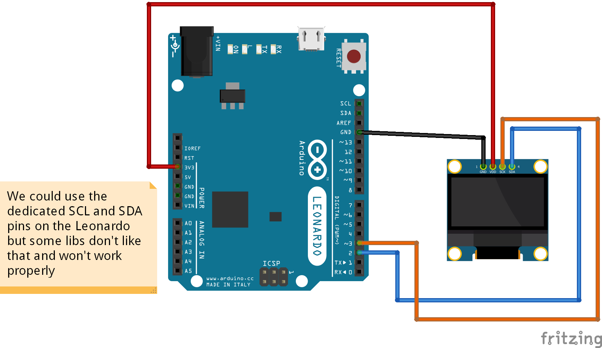

# SSD1306 OLED screen with Arduino Leonardo/Arduino Pro Micro

To learn more on OLED display (how to wire it), check the [README](../Test-screen-SSD1306-128x64-adafruit/README.md) in the `Test-screen-SSD1306-128x64-adafruit` folder

## Schema

## Code

This test uses 1 library:
* [u8g2](https://github.com/olikraus/u8g2)

I'm running this program on a Pro Micro. The compiler indicates 17338 bytes (60%) of program space used, 899 bytes (35%) of dynamic memory. This is quite heavy. u8g2 has a lot of features though.